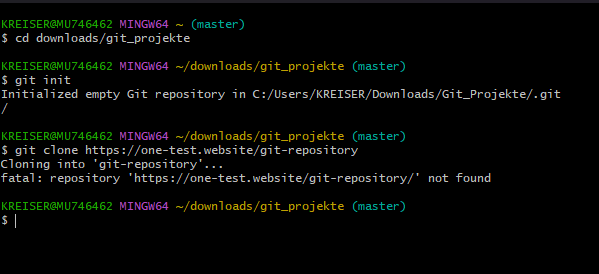
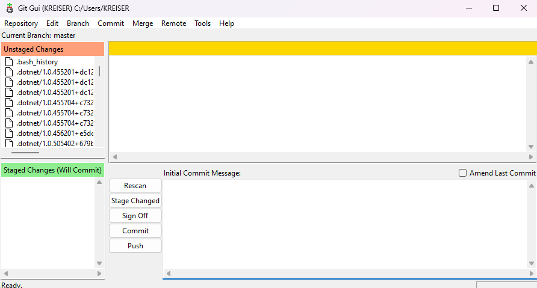

# Git - Versionskontrolle einfach erklärt

Diese Einführung ist Teil des [Pre-Work-Pakets](../../../collection-it-prwrkpckg).

## Inhaltsverzeichnis
1. [Was ist Git?](#was-ist-git)
2. [Grundlagen zur Verwendung von Git](#grundlagen-zur-verwendung-von-git)
3. [Weiterführende Quellen](#weiterführende-quellen)
4. [GitHub und GitLab als Entwicklungsplattformen](#github-und-gitlab-als-entwicklungsplattformen)
5. [Umsetzung im Onboarding-Paket](#umsetzung-im-onboarding-paket)


## Was ist Git?
Git ist das am weitesten verbreitete Versionskontrollsystem (VCS) der Welt und wurde 2005 von Linus Torvalds, dem Entwickler von Linux, als Open-Source-Projekt ins Leben gerufen.  
Versionskontrollsysteme dienen zum Verfolgen von Änderungen an Quelltexten. Es werden während der Bearbeitung Momentaufnahmen der Dateien erstellt und dauerhaft gespeichert, um bei Bedarf wieder verfügbar zu sein.  

Somit wird die Praxis, eine Datei mehrmals mit unterschiedlichen Namen auf dem Rechner zu speichern, um verschiedene Zustände zu sichern, mit allen leider nur zu gut bekannten Tücken, wie etwa final.doc oder wirklichfinal.doc bis zu jetzabertatsächlichwirklichfinal.doc, obsolet.  
Bei Git handelt es sich dabei um ein verteiltes Versionskontrollsystem ("distributed" VCS / DVCS). Dies kennzeichnet sich dadurch, dass jede Arbeitskopie eines Repositorys (= zentraler Projektordner, dessen Inhalt im VCS erfasst wird) den vollständigen Verlauf aller Änderungen enthält.


### Vorteile einer Versionskontrolle
- Erstellen einheitlicher Workflows
- Arbeiten mit Versionen zum einfachen Nachvollziehen von Änderungen
- Vereinfachtes Arbeiten mit anderen Entwicklern im gleichen Repository
- Vereinfachtes Verständnis des Quellcodes durch Betrachtung der Historie


## Grundlagen zur Verwendung von Git
### Installation
Bitte beachte, dass Git nicht vorinstalliert ist und daher auf deinem PC heruntergeladen und installiert werden muss. Klicke [hier](https://git-scm.com/downloads), um Git herunterzuladen und wähle dann dein Betriebssystem aus.  
Außerdem besteht die Möglichkeit, eine portable Version für Windows herunterzuladen, die direkt von einem externen Speichermedium ausgeführt werden kann. 
Auf Raspberry Pi OS ist Git bereits vorinstalliert.

Eine weitere Möglichkeit ist es, alternative Git-Versionen von Drittanbietern zu installieren. Diese unterscheiden sich maßgeblich in ihrem GUI (Graphical User Interface). Eine Übersicht findet sich [hier](https://git-scm.com/downloads/guis).  
Diese Anleitung bezieht sich jedoch auf die Arbeit mit der Befehlszeile und benötigt keine Drittanbieter-Version.

Für alle Befehle, die mit Git zu tun haben, kannst du das Terminal (unter Linux) oder das Programm "Git Bash" (unter Windows) verwenden. Git Bash wird bei der Installation von Git wird bei Windows automatisch installiert ist eine Git-Befehlszeile für Windows, die das Verhalten von Linux-Terminals emuliert. Um sie zu öffnen, kannst du in Windows 11 den Dateiexplorer öffnen, mit Shift+Rechtsklick das Kontextmenü öffnen und auf "Git Bash Here" klicken.

### Git konfigurieren
Bevor du Git verwendest, solltest du einige grundlegende Konfigurationseinstellungen vornehmen. Dazu gehören Name und E-Mail-Adresse, die in deinen Commit-Nachrichten verwendet werden. 
Nun kannst du die folgenden Befehle ausführen:

```
git config --global user.name "Dein Name"
git config --global user.email "Deine E-Mail"
```

### Ein Repository erstellen
Zum Erstellen wird zunächst mittels 
```
cd <gewünschter Pfad>
``` 
in das gewünschte Verzeichnis zum Speichern gewechselt und mit 
```
git init
``` 
ein leeres Repository erstellt. 
Achtung: `git init` erstellt keinen neuen Ordner, sondern wandelt den aktuellen Ordner in ein Repository um.

Wenn das gewünschte Repository bereits anderorts existiert, kann man mit 
```
git clone <Web- oder Netzadresse zum Verzeichnis>
```
eine lokale Arbeitskopie auf dem Rechner anlegen. 



### Notiz vorab

Damit du die folgenden Befehle ausführen kannst, musst du dich mit dem Terminal in einem git-Repository befinden.

### Status des Repository überprüfen und Dateien hinzufügen
```
git status
```
Der Befehl ist besonders nützlich, um zu überprüfen, ob alle gewünschten Änderungen hinzugefügt und committed wurden. Es zeigt auch, auf welchem Branch du dich gerade befindest und ob dieser Branch aktuell ist.


### Änderungen verfolgen
Nachdem Änderungen an Dateien vorgenommen wurden oder neue Dateien im Arbeitsverzeichnis erstellt wurden, kannst du den 
```
git add <Dateiname>
```
Befehl verwenden, um diese Änderungen zur Nachverfolgung hinzuzufügen.
Ein Punkt anstelle des Dateinamens fügt alle Änderungen im aktuellen Verzeichnis und allen Unterordnern hinzu.


### Einen Commit erstellen
Wenn du aktuelle Änderungen festhalten möchtest, verwende den `git commit`  Befehl. Dieser erstellt einen "Commit" (Snapshot) der mit `git add` hinzugefügten Änderungen, die später referenziert werden können.
```
git commit -m "Eine aussagekräftige Commit-Nachricht"
```


### Branches
Branches sind eine Möglichkeit, an verschiedenen Features oder Ideen unabhängig voneinander zu arbeiten. Um einen neuen Branch mit dem beispielhaften Namen feature_x zu erstellen, verwende den `git branch` Befehl.
```
git branch feature_x
```
Um zu diesem Branch zu wechseln, verwende den `git checkout` Befehl.
```
git checkout feature_x
```
Um einen Branch zu erstellen und sofort zu ihm zu wechseln, kannst du  den -b Modifier verwenden.
```
git checkout -b feature_x
```

Ein neues Git-Repository hat standardmäßig einen Branch mit dem Namen `main` (bei älteren Repositories manchmal auch `master`). Im professionellen Umfeld arbeitet man nicht aktiv auf diesem Branch, sondern fügt auf anderen Branches entwickelte und getestete Teile des Programmes ein. Das sorgt dafür, dass man auf dem `main`-Branch immer eine lauffähige Version des Programms finden kann. Für den Anfang kannst du aber auch auf `main` arbeiten.


### Änderungen hochladen
Um Änderungen aus deinem aktuell ausgewählten Branch in ein Remote-Repository hochzuladen (meist das, aus dem deine Arbeitskopie erzeugt wurde), verwende den `git push` Befehl.
```
git push origin main
```
Hierbei steht origin für das Remote-Repository und main für den Branch, zu dem du pushen möchtest. 


### Änderungen abrufen
Wurden auf dem Remote-Repository Änderungen durchgeführt, die du auf deinem lokalen Branch noch nicht hast, musst du zum Weiterarbeiten die Änderungen auf dein lokales Repository holen. Verwende hierfür den `git pull` Befehl.
```
git pull origin main
```

Diese Befehle sind nur einige der vielen, die Git bietet, aber sie sollten für den Anfang ausreichen, um es zu bedienen.


## Weiterführende Quellen 
### Offizielle Git Dokumentation
Um zur Dokumentation zu gelangen, klicke [hier](https://git-scm.com/docs).

### Cheat-Sheet
Das Cheat-Sheet ist eine übersichtliche Sammlung der wichtigsten Git-Befehle. Klicke [hier](https://training.github.com/downloads/de/github-git-cheat-sheet/), um es anzuzeigen.

### Interaktives Git-Tutorial
Dieses [Git-Tutorial](https://learngitbranching.js.org/?locale=de_DE) bietet dir die Möglichkeit mit Git herumzuprobieren und dir die Auswirkungen der Befehle grafisch anzeigen zu lassen.


## GitHub und GitLab als Entwicklungsplattformen
GitHub und GitLab sind webbasierte Hosting-Dienste für Git-Repositories. Sie bieten eine grafische Benutzeroberfläche und eine Reihe von Tools, die die Zusammenarbeit zwischen Entwicklern erleichtern. Darüber hinaus bieten beide Plattformen Funktionen wie Issue-Tracking, Code-Reviews, Continuous Integration und Deployment sowie verschiedene Möglichkeiten zur Kommunikation zwischen verschiedenen Entwicklern.


### Unterschiede zu Git
Während Git ein Tool ist, das als lokale Instanz läuft und hilft, Code-Änderungen zu verwalten, sind GitHub und GitLab Plattformen, die auf Servern laufen. Sie ermöglichen es, Git-Repositories online zu speichern und zu teilen und bieten zusätzliche Funktionen, die über die von Git hinausgehen.  
Ein wichtiger Unterschied ist, dass Git primär ein Kommandozeilen-Tool ist - Git GUI hat nur eine rudimentäre grafische Benutzeroberfläche - , während GitHub und GitLab eine benutzerfreundliche Weboberfläche bieten. Dies macht sie zugänglicher für Menschen, die nicht mit der Kommandozeile vertraut sind.  

#### GitHub Weboberfläche


#### Git GUI Oberfläche


Darüber hinaus bieten GitHub und GitLab Funktionen, die in Git nicht eingebaut sind, wie z.B. Pull Requests und Issues. Diese Funktionen erleichtern die Zusammenarbeit und Kommunikation zwischen Entwicklern.  
Obwohl GitHub und GitLab auf Git basieren, sind sie nicht dasselbe. Sie sind Erweiterungen von Git, die darauf abzielen, die Zusammenarbeit und das Management von Softwareprojekten zu erleichtern.

### Visual Studio Code und Git
Für eine benutzerfreundlichere Erfahrung empfehlen wir die Verwendung von Visual Studio Code (VS Code) mit der integrierten Versionskontrolle. Visual Studio Code ist ein beliebter Code-Editor von Microsoft, der eine Vielzahl von Funktionen bietet und mit Plugins erweitert werden kann - darunter die Integration von Git.

Dies erleichtert die Verwendung von Git, indem VS Code eine grafische Benutzeroberfläche für Git-Befehle bietet. Somit kannst du viele Git-Operationen durchführen, ohne die Befehlszeile zu verwenden. Um weitergehende Information über die Verwendung von Git in VS Code zu erhalten, klicke [hier](https://code.visualstudio.com/docs/sourcecontrol/overview).

